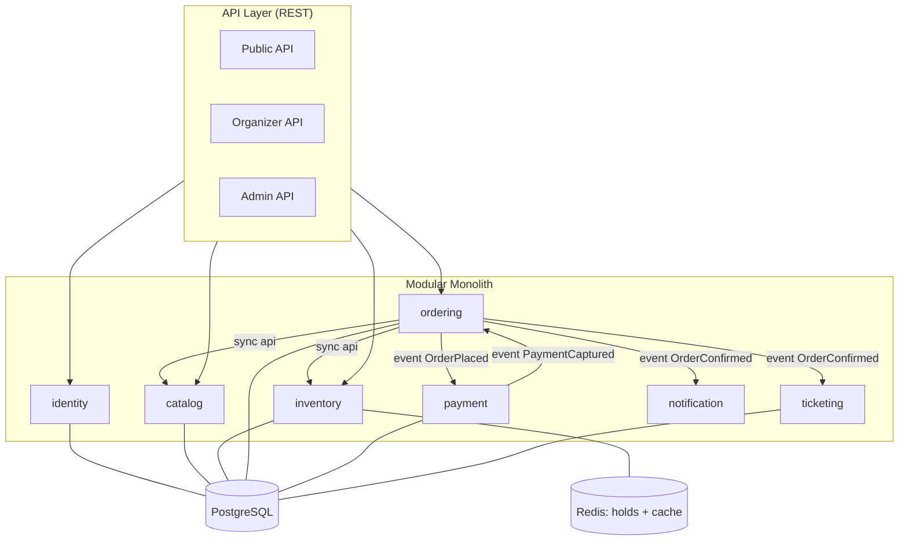

# Comprehensive Backend Plan — High-Traffic Event Ticketing Platform

> **Purpose of this document**: build a real, running backend; learn the core backend engineering techniques; and make sure **everything learned is backed by measurements**. This is the technical foundation for the thesis — the AI/agent layer gets bolted on later, not now.

---

## 0. Guiding principles

Read these five lines before every coding session. If you're violating one, you've drifted.

1. **Never optimize what you haven't measured.** Every performance change needs a "before" and an "after" number. No number → it doesn't go in the thesis.
2. **Change one variable at a time.** Add an index and change the locking strategy in the same run, and you'll never know which one mattered.
3. **Correctness first, speed second.** Zero oversell is a hard constraint. A fast system that sells the same seat twice is a broken system.
4. **Features are the enemy.** Every feature must answer: "which experiment or which thesis chapter does this serve?" No answer → cut it.
5. **Build the monolith as if every module will become a microservice.** The test question: *"If I had to extract this module as its own service next week, what would block me?"*

---

## 1. Problem & requirements

### 1.1 Functional

| Area | Capability | Required |
|---|---|---|
| Identity | Register, login, JWT, refresh token, roles (USER / ORGANIZER / ADMIN) | ✅ |
| Catalog | Create events, shows, ticket tiers, seat maps | ✅ |
| Inventory | Temporary seat holds with TTL, confirm, release, oversell prevention | ✅ **core** |
| Order | Order creation, state machine, expiry, cancellation | ✅ |
| Payment | Mock gateway: authorize / capture / fail / timeout / webhook | ✅ |
| Ticket | Issue tickets after payment, QR payload (signed string), check-in | ⬜ nice to have |
| Notification | Email/SMS mock, async, with retry | ⬜ nice to have |
| Waiting room | Virtual queue in front of the seat-selection page | ⬜ advanced |

### 1.2 Non-functional — this is what actually drives the architecture

| Target | Goal | Notes |
|---|---|---|
| Oversell | **Exactly 0** | Hard constraint, never traded away |
| Throughput | ≥ 1,000 successful bookings/sec | On local hardware; lower is fine if the setup is documented |
| Booking API latency | p95 < 300ms, p99 < 800ms | Measured at saturation |
| Concurrency | 20,000 virtual users contending for 1,000–5,000 seats | Flash-sale scenario |
| Availability | Redis down → system still correct (just slower) | Proven by chaos test |
| Idempotency | Repeated booking calls never create two orders | Mandatory |

### 1.3 Back-of-envelope scale estimate

```
Large event:        50,000 seats
On-sale:            concurrent arrivals ≈ 10× seats = 500,000
Peak window:        first 60 seconds
→ Peak read QPS  (seat map views, status polling): ~50,000 QPS
→ Peak write QPS (hold + confirm):                  ~2,000 QPS
→ Read:write ratio ≈ 25:1  →  read-heavy, caching is mandatory
→ Hotspot: EVERY write targets a single show_id → this is the real problem
```

**What the estimate tells you**: the challenge isn't aggregate load, it's the **hot partition** — every transaction contends for the same small set of seats. That contention is precisely what makes this topic academically interesting.

---

## 2. Overall architecture

### 2.1 Choice: modular monolith

Not because "it's simpler," but because:
- One person, one deployable → time goes into the core problem instead of ops.
- Splitting into services in semester 2 then yields a **before/after comparison on the same codebase** — that's a real thesis contribution.
- Going distributed from day one means every slow number gets blamed on the network, and you learn nothing about the database.

### 2.2 Module diagram



### 2.3 Module table

| Module | Responsibility | Public API (`api/`) | Events published |
|---|---|---|---|
| `identity` | Users, auth, JWT, roles | `UserService`, `UserDto` | — |
| `catalog` | Event, Show, TicketTier, SeatMap | `CatalogService.getShow/getPrice` | `ShowPublished` |
| `inventory` | Hold, allocate, release seats | `InventoryService.hold/confirm/release` | `SeatHeld`, `SeatReleased` |
| `ordering` | Order aggregate, state machine, saga | `OrderService.place/cancel` | `OrderPlaced`, `OrderConfirmed`, `OrderExpired` |
| `payment` | Mock PSP, idempotent charge, webhook | `PaymentService.authorize/capture` | `PaymentCaptured`, `PaymentFailed` |
| `ticketing` | Issue tickets, QR payload, check-in | `TicketService.issue` | `TicketIssued` |
| `notification` | Email/SMS mock, retry, DLQ | (subscriber only) | — |

**Three non-business modules** (detailed in §2.5):

| Module | Role | Contents | Constraint |
|---|---|---|---|
| `shared` | Domain kernel | `Money`, `OrderId`, `ShowId`, `DomainEvent` | Plain Java, **no Spring**, ≤ 15 classes |
| `platform` | Technical common | `ApiResponse`, `ErrorResponse`, `GlobalExceptionHandler`, correlation-ID filter, Jackson/OpenAPI config | **Imports no business module** |
| `app` | Composition root | `@SpringBootApplication`, DataSource, top-level security chain, `application.yml` | Neither extractable nor shareable |

### 2.4 Package layout

```
src/main/java/com/thesis/ticketing/
├── TicketingApplication.java      # app: composition root
├── config/                        # app: DataSource, Flyway, top-level security chain, scheduler
├── platform/                      # technical common — OPEN module
│   ├── web/       ApiResponse, ErrorResponse, PageResponse, GlobalExceptionHandler
│   ├── error/     DomainException, NotFoundException, ConflictException
│   ├── tracing/   CorrelationIdFilter, MDC
│   └── config/    JacksonConfig, OpenApiConfig, CorsConfig
├── shared/                        # domain kernel — no Spring
├── identity/
│   ├── api/          # PUBLIC — the only package other modules may import
│   ├── domain/       # package-private
│   └── infra/        # package-private (JPA, controllers, module-local config)
├── catalog/{api,domain,infra}
├── inventory/{api,domain,infra}
├── ordering/{api,domain,infra}
├── payment/{api,domain,infra}
├── ticketing/{api,domain,infra}
└── notification/{api,domain,infra}
```

### 2.5 Three kinds of "common" — where each belongs

The only classification question: *"When services get extracted in semester 2, will this be **copied into every service** (→ `platform`), **travel with one module** (→ that module), or **rewritten per service** (→ `app`)?"*

**Dependency direction is one-way:**

```
business module → platform → (nothing)
business module → shared   → (nothing)
app            → everything
```

Write the ArchUnit rule blocking the reverse direction in Phase 0 — it will be violated the first time you're in a hurry.

**Envelope in `platform`, payload in the module:**

```java
// platform/web — knows the shape, knows nothing about the domain
public record ApiResponse<T>(T data, ErrorBody error, Meta meta) { }

// ordering/infra — the controller combines the two
public ApiResponse<OrderDto> place(...) { ... }   // OrderDto belongs to ordering.api
```

**Config splits three ways:**

| Kind | Examples | Location |
|---|---|---|
| Technical, cross-cutting | ObjectMapper, OpenAPI, CORS, OTel exporter, Redis connection factory | `platform/config` |
| Module-local | `inventory.hold.ttl`, Lua script bean, the module's `@ConfigurationProperties`, its own `SecurityFilterChain` | `<module>/infra/config` |
| Assembly | DataSource, Flyway locations, `@EnableScheduling`, top-level security chain | `app/config` |

Redis example: the shared connection factory goes in `platform`; the seat-hold Lua script, key serializer, and TTL go in `inventory/infra/config`. When `inventory` is extracted, its Redis specifics travel with it and the generic part stays in the starter JAR.

Security example: the JWT **validation** filter goes in `platform`; token **issuance** and user lookup belong to `identity`; each module declares its own `SecurityFilterChain` with an `@Order` rather than centralizing every rule in one file.

**Spring Modulith configuration** — `platform` and `shared` must be open modules, otherwise Modulith flags every access to their internals:

```java
// platform/package-info.java  (same for shared/package-info.java)
@org.springframework.modulith.ApplicationModule(
    type = ApplicationModule.Type.OPEN
)
package com.thesis.ticketing.platform;
```

**Three traps:**

1. **A central `ErrorCode` enum** in `platform` listing every module's errors — now adding a business error means editing platform, which is coupling in disguise. Platform defines only the shape (`code` as a `String`, or an `ErrorCode` interface); each module declares its own enum.
2. **Putting business entities or services in `shared/`** because "two modules need it" — either the boundary is cut wrong, or one side should call the other's `api`.
3. **`platform` bloating into "utils"** — the appearance of `StringUtils` or `DateUtils` signals it's becoming a dumping ground. Platform holds only what concerns the technical contract between modules and the outside world.

### 2.6 Hard database rules

| Rule | Why |
|---|---|
| One PostgreSQL **schema** per module | Extraction in semester 2 is just a datasource URL change |
| **No** foreign keys across schemas | Cross-schema FKs make extraction impossible |
| **No** joins across schemas | Need another module's data → call its `api` or subscribe to an event |
| One Flyway migration folder per module | `db/migration/inventory/V1__...sql` |
| Denormalize deliberately | `payment` needs an email → copy it from the event payload, don't FK to it |

---

## 3. The core problem: preventing oversell under load

This is the **heart of the thesis**. You will implement and measure **four strategies**, not pick one.

### 3.1 The four strategies

#### V1 — Pessimistic locking (baseline)

```sql
SELECT * FROM inventory.seat
WHERE id = ANY(:seatIds) AND status = 'AVAILABLE'
FOR UPDATE;
```

- **What you learn**: Postgres locking, lock waits, deadlocks, why lock ordering matters.
- **Where it breaks**: connection pool exhaustion, lock wait timeouts, throughput ceiling tied to connection count.
- **Measurement tip**: enable `log_lock_waits = on`, query `pg_locks`.

#### V2 — Optimistic locking

```java
@Version private long version;
```

- **What you learn**: `OptimisticLockException`, retry strategy, exponential backoff with jitter.
- **Where it breaks**: conflict rate grows non-linearly with concurrency; on a hot key it may be **worse** than pessimistic.
- **Metrics to capture**: retry rate, average retries per success, failure rate after N retries.

#### V3 — Atomic counter / conditional update (no row lock)

```sql
UPDATE inventory.tier_stock
SET available = available - :qty
WHERE tier_id = :tierId AND available >= :qty
RETURNING available;
```

- **What you learn**: single-statement atomicity, why read-then-write is always wrong, row-level contention.
- **Fits**: general admission (no seat selection). Combine with V1 for reserved seating.

#### V4 — Redis hold + TTL, database as source of truth

```
Lua script (atomic):
  KEYS: seat:{showId}:{seatId}
  if no hold exists → SET with 600s TTL, return OK
  otherwise         → return CONFLICT
After payment → write to DB, delete the key
Redis down → fall back to V1
```

- **What you learn**: atomic Lua scripts, TTL-based expiry, cache-aside, and the most expensive lesson of all: what to do when cache and database disagree.
- **Must handle**: Redis says "held" but the process dies before the DB write → a **reconciliation job** that periodically compares both sides.

### 3.2 Experiment matrix

This table is the **central results table** of the thesis. Fill it completely.

| Strategy | Concurrency | Throughput (bookings/s) | p95 (ms) | p99 (ms) | Oversell | Retry % | Deadlocks | Notes |
|---|---|---|---|---|---|---|---|---|
| V1 Pessimistic | 1k / 5k / 20k | | | | must be 0 | — | | |
| V2 Optimistic | 1k / 5k / 20k | | | | must be 0 | | | |
| V3 Atomic counter | 1k / 5k / 20k | | | | must be 0 | — | | |
| V4 Redis + TTL | 1k / 5k / 20k | | | | must be 0 | | | |
| V4 + Redis killed mid-run | 5k | | | | **must be 0** | | | chaos test |

> **Warning**: if any "Oversell" cell is non-zero, that isn't a bad result — it's potentially **the best finding in the thesis**, as long as you can explain why it happened. Don't hide it.

---

## 4. Tech stack — and what each choice costs

| Component | Choice | What it buys | What it costs |
|---|---|---|---|
| Language | Java 21 | Virtual threads, records, pattern matching | — |
| Framework | Spring Boot 3.3+ | Ecosystem, familiarity | Slow startup |
| Module boundaries | Spring Modulith | Verification + auto-generated diagrams | New concepts to learn |
| Architecture tests | ArchUnit | Violations caught in CI | Writing rules takes time |
| Database | PostgreSQL 16 | MVCC, partitioning, excellent `EXPLAIN ANALYZE` | — |
| Migrations | Flyway | Versioned, CI-friendly | — |
| Cache/locks | Redis 7 | Atomic Lua, TTL, speed | One more failure point |
| Connection pool | HikariCP | Default, easy to tune | — |
| Testing | JUnit 5 + Testcontainers | Real Postgres and Redis in tests | Slower than H2 — but H2 lies |
| Load testing | **k6** | JS scripting, clean metric export, lightweight | Syntax to learn |
| Metrics | Micrometer + Prometheus + Grafana | Live p95/p99 | Initial setup |
| Tracing | OpenTelemetry + Jaeger/Tempo | See exactly where time goes | Small overhead |
| Profiling | async-profiler + JFR | Flame graphs, real hotspots | Learning to read them |

**Deliberately NOT used at this stage**: Kafka (semester 2), Kubernetes (unnecessary), service mesh (unnecessary), GraphQL (solves none of the problems here).

---

## 5. Build roadmap — 8 phases

Each phase has: **learn → build → measure → done when**. Don't start a new phase until the previous one has numbers.

---

### Phase 0 — Foundation (weeks 1–2)

**Learn**: Spring Modulith, ArchUnit, Testcontainers, multi-schema Flyway, Docker Compose.

**Build**:
- Bootstrap the project: 7 empty business modules in the correct `api/domain/infra` shape, plus `platform/`, `shared/`, and `app/`.
- Mark `platform` and `shared` as OPEN modules; add the ArchUnit rule forbidding `platform`/`shared` from importing any business module.
- `ApplicationModules.of(App.class).verify()` running in CI.
- `docker-compose.yml`: Postgres, Redis, Prometheus, Grafana, Jaeger.
- Flyway creating all 7 schemas (one per business module; `platform`/`shared`/`app` own none).
- GitHub Actions: build + test + architecture verification.
- One working `/actuator/health` endpoint.

**Measure**: build time, app startup time (record them — you'll compare once the codebase grows).

**Done when**: `docker compose up` plus `./gradlew test` is green, and deliberately importing the wrong package turns the build **red**.

---

### Phase 1 — Domain core, speed not yet a concern (weeks 3–4)

**Learn**: tactical DDD (aggregates, value objects, invariants), JPA mapping, state machines.

**Build**:
- `catalog`: Event → Show → TicketTier → Seat, with seat-map generation from a config.
- `identity`: registration/login, JWT + refresh, Spring Security filter chain.
- `ordering`: Order aggregate plus state machine.

```
PENDING ──hold ok──> AWAITING_PAYMENT ──captured──> CONFIRMED
   │                       │                            │
   │                    timeout/fail                  refund
   ▼                       ▼                            ▼
FAILED                  EXPIRED                     REFUNDED
```

- Every invalid transition must throw, with a test proving it.

**Measure**: no performance work yet. Measure **state machine test coverage** — every valid edge and at least five invalid ones.

**Done when**: you can create an event with 10,000 seats and place one order end-to-end with `curl`.

---

### Phase 2 — Correct booking (weeks 5–6) ⭐ the most important phase

**Learn**: transaction isolation levels, locking, idempotency, race conditions.

**Build**:
- Implement **V1 pessimistic locking**.
- **Idempotency keys**: `Idempotency-Key` header, an `ordering.idempotency_record (key, request_hash, response_body, created_at)` table with a unique index on `key`.
- **Hold expiry**: a scheduled job releasing expired seats (use `@Scheduled` + `SELECT ... FOR UPDATE SKIP LOCKED` so multiple instances don't collide).
- Payment mock: authorize/capture/fail with configurable failure rate and latency.
- **A concurrency test written in code** (not k6): 200 threads contending for one seat → exactly one wins.

```java
@Test
void only_one_booking_wins_the_seat() throws Exception {
  var latch = new CountDownLatch(1);
  var success = new AtomicInteger();
  var pool = Executors.newVirtualThreadPerTaskExecutor();
  for (int i = 0; i < 200; i++) {
    pool.submit(() -> {
      latch.await();
      try { orderService.place(cmd(seatId)); success.incrementAndGet(); }
      catch (SeatUnavailableException ignored) {}
      return null;
    });
  }
  latch.countDown();
  pool.close();
  assertThat(success.get()).isEqualTo(1);   // hard constraint
}
```

**Measure**: that test must pass 50 times in a row. If it's flaky, you have a real race condition — don't wave it away.

**Done when**: there is no way to book the same seat twice.

---

### Phase 3 — Baseline with numbers (week 7)

**Learn**: k6, load-testing methodology, warm-up, percentiles vs averages.

**Build**:
- A data generator: 100 events, 5,000–50,000 seats each.
- Four k6 scenarios:

| Scenario | Description | Purpose |
|---|---|---|
| `smoke` | 10 VUs, 1 minute | Verify the script itself |
| `flash-sale` | 0 → 20,000 VUs in 30s, hold 2 minutes | The main scenario |
| `soak` | 500 VUs, 30 minutes | Find memory and connection leaks |
| `browse-heavy` | 90% reads, 10% writes | Check cache effectiveness |

- A standard procedure for EVERY run (script it, don't do it by hand):
  1. Reset the database to a fixed snapshot
  2. Restart the app
  3. Warm up for 60s (JIT + caches)
  4. Measure for 5 minutes
  5. Export metrics to CSV, tagged with the git commit hash

**Measure**: the full baseline table for V1.

**Done when**: three runs of the same scenario vary by less than 10% in throughput. Noisier than that and every later comparison is meaningless.

---

### Phase 4 — Database optimization (weeks 8–10)

**Learn**: `EXPLAIN (ANALYZE, BUFFERS)`, index strategy, N+1, connection pool sizing, partitioning.

**Build** — each item is **its own experiment with before/after numbers**:

| # | Experiment | How to measure |
|---|---|---|
| 4.1 | Enable `pg_stat_statements`, find the top 10 slow queries | Query list + total time |
| 4.2 | Add the right index for each one | Compare `EXPLAIN` before/after, plus index size |
| 4.3 | Composite index vs covering index (`INCLUDE`) | Does an index-only scan actually happen |
| 4.4 | Kill Hibernate N+1 (`@EntityGraph`, `join fetch`, batch size) | Count queries with `datasource-proxy` |
| 4.5 | Tune HikariCP: pool 10 / 20 / 50 / 100 | Plot throughput vs pool size — **it will peak, then decline** |
| 4.6 | Partition `seat` and `ticket` by `show_id` | Query time + VACUUM time |
| 4.7 | `READ COMMITTED` vs `REPEATABLE READ` | Throughput vs serialization errors |
| 4.8 | Batch ticket inserts (JDBC batch + `reWriteBatchedInserts=true`) | Time to generate 50,000 tickets |
| 4.9 | Read replica for the seat-map read path | Read throughput + replication lag |

> **The classic lesson you'll discover in 4.5**: past a certain point, a bigger connection pool makes throughput **worse**. Explaining why (context switching, lock contention) makes a strong thesis section.

**Measure**: a before/after table per experiment, with concrete numbers and a causal explanation.

**Done when**: at least six experiments have numbers and explanations.

---

### Phase 5 — Caching and the remaining hold strategies (weeks 11–12)

**Learn**: cache-aside, cache stampede, Redis Lua, distributed locks and their traps.

**Build**:
- Cache the seat map (the heaviest read). Handle **cache stampede** via single-flight or TTL jitter.
- Implement **V2 optimistic**, **V3 atomic counter**, **V4 Redis hold**.
- Make the strategy switchable by config (`booking.strategy=PESSIMISTIC|OPTIMISTIC|COUNTER|REDIS`) so all four are measured on the same binary.
- **Chaos test**: kill Redis mid-load-test → verify oversell is still 0.
- A reconciliation job comparing Redis and the DB, logging every discrepancy.

**Measure**: complete the experiment matrix from §3.2, plus cache hit rate and read latency before/after caching.

**Done when**: all four strategies run and have comparable numbers on the same scenario.

---

### Phase 6 — Resilience and observability (weeks 13–14)

**Learn**: timeouts, retry with backoff, circuit breakers, bulkheads, rate limiting, graceful degradation, RED metrics.

**Build**:
- Resilience4j: circuit breaker + timeout on the payment mock; bulkheads separating read and write pools.
- Rate limiting per user and per IP (token bucket on Redis).
- Outbox pattern for events (prepares for Kafka in semester 2) — **doing it here means semester 2 only swaps the publisher**.
- Retry + dead-letter table for notifications.
- Grafana dashboard: RED (Rate, Errors, Duration) + connection pool + Redis + JVM.
- OpenTelemetry: traces spanning HTTP → service → DB, with `traceId` in the logs.

**Measure**:
- Recovery time when the payment mock fails (with vs without a circuit breaker).
- Error rate with rate limiting on vs off, above the threshold.
- Tracing overhead: throughput with vs without tracing (usually 2–5% — measure it rather than assume).

**Done when**: killing any dependency (Redis, payment mock) degrades the system in a controlled way instead of taking it down.

---

### Phase 7 — Freeze the numbers and write (weeks 15–16)

**Build**:
- Re-run the **entire** matrix on a clean environment, on the same day, with the same configuration.
- Produce charts: throughput vs concurrency (four lines), latency distributions, the pool-size sweep.
- Write `EXPERIMENTS.md`: each experiment as hypothesis → setup → results → explanation → surprises.
- Write `ADR/` (architecture decision records) for the 8–10 major decisions.
- A README with diagrams and a one-command run.

**Done when**: someone else can clone the repo, run `make demo`, and reproduce your results.

---

## 6. Testing strategy

| Level | Tooling | Volume | Purpose |
|---|---|---|---|
| Unit | JUnit 5 + Mockito | Many | Pure domain logic, no Spring |
| Module isolation | `@ApplicationModuleTest` | 1 per module | Proves the module is extractable |
| Integration | `@SpringBootTest` + Testcontainers | Moderate | Main flows against a real DB |
| Concurrency | JUnit + virtual threads | 5–10 | **Proves no oversell** |
| Architecture | Modulith `verify()` + ArchUnit | Every build | Blocks boundary violations |
| Contract | Spring REST Docs / OpenAPI diff | Light | Prepares for semester 2 extraction |
| Load | k6 | 4 scenarios | Generates the thesis data |
| Chaos | Toxiproxy / docker kill | 3–4 | Proves resilience |

**Rule**: use Testcontainers, **never H2**. H2's locking semantics differ from Postgres — tests that pass on H2 and break on Postgres are the most common trap here, and it would undermine the exact core of the topic.

---

## 7. Experiment log template

Copy this for **every** experiment. It's what turns "coding for fun" into a thesis.

```markdown
## EXP-014: Effect of HikariCP pool size on throughput

**Hypothesis**: throughput increases linearly with pool size until the CPU saturates.

**Setup**
- Commit: a3f9c21
- Hardware: 8 vCPU / 16GB RAM, Postgres on the same machine
- Scenario: k6 flash-sale, 5,000 VUs, 5 minutes, 60s warm-up
- Variable: `hikari.maximum-pool-size` ∈ {10, 20, 50, 100, 200}
- Everything else held constant

**Results**

| Pool | Throughput | p95 | p99 | Errors | DB CPU |
|---|---|---|---|---|---|
| 10 | | | | | |
| 20 | | | | | |
| 50 | | | | | |
| 100 | | | | | |
| 200 | | | | | |

**Explanation**: ...

**Surprises**: ...

**Conclusion / chosen value**: ...
```

---

## 8. Definition of "complete backend" — checklist

Only tick what you've actually done, not what you assume works.

**Correctness**
- [ ] Zero oversell in every scenario, including with Redis down
- [ ] Idempotency works (repeated calls never create two orders)
- [ ] Expired orders release their seats, even across an app restart
- [ ] No transaction spans two modules
- [ ] Concurrency test green 50/50 runs

**Engineering**
- [ ] Migrations run cleanly from an empty database to head
- [ ] No N+1 queries on the main endpoints (with numbers proving it)
- [ ] An index for every query in the `pg_stat_statements` top 10
- [ ] Circuit breaker + timeout on every external dependency
- [ ] Rate limiting works
- [ ] Outbox pattern ready to switch to Kafka

**Operations**
- [ ] `docker compose up` is enough to run everything
- [ ] Grafana dashboard with RED metrics
- [ ] Logs carry `traceId`, traces span the whole request
- [ ] Health checks distinguish liveness from readiness
- [ ] Graceful shutdown (no in-flight orders lost)

**Academic**
- [ ] ≥ 12 experiments with numbers and explanations
- [ ] All four hold strategies measured on the same scenario
- [ ] ≥ 8 ADRs
- [ ] Results are reproducible

---

## 9. Distractions to avoid (re-read every two weeks)

| Temptation | Why to skip it |
|---|---|
| A polished frontend | Contributes nothing to the thesis. Postman and k6 are enough |
| Adding Kafka now | Destroys the before/after comparison planned for semester 2 |
| A real payment gateway | Time-consuming, teaches nothing about performance |
| Microservices early | Every slow number gets blamed on the network |
| Kubernetes | That's ops, not backend engineering |
| Micro-optimizing Java (algorithms, streams) | 95% of the time is in the DB and network, not the CPU |
| More CRUD (promotions, reviews, chat) | Nothing there to measure |
| Optimizing before you have a baseline | Proves nothing |

---

## 10. Skills map

| Topic | Phase | Evidence in the repo |
|---|---|---|
| DDD, aggregates, bounded contexts | 1 | Module map + ADRs |
| Modular monolith, boundary enforcement | 0, 1 | ArchUnit + Modulith verify |
| Transactions, isolation, locking | 2, 4 | Isolation-level experiment |
| Race conditions & concurrency | 2, 5 | Concurrency tests + four strategies |
| Idempotency | 2 | Idempotency table + tests |
| DB indexing & query tuning | 4 | Nine EXPLAIN experiments |
| Connection pools & saturation | 4 | Pool sweep chart |
| Partitioning | 4 | Partitioning experiment |
| Caching & stampede | 5 | Cache hit rate |
| Redis, atomic Lua | 5 | Script + chaos test |
| Resilience patterns | 6 | Circuit breaker experiment |
| Outbox pattern | 6 | Kafka-ready |
| Observability, tracing | 6 | Dashboard + traces |
| Load-testing methodology | 3, 7 | Standardized procedure |

---

## 11. What comes after this plan

- **Semester 2**: extract `inventory` and `payment` into their own services, replace in-process events with Kafka, swap the outbox publisher, re-run the whole matrix → **a monolith vs microservices comparison on the same problem**. This is the strongest chapter of the thesis.
- **Semester 3**: pgvector + RAG + an AI agent doing tool calls against the very `api/` interfaces designed here. Because `api/` is clean, the agent is just another caller.
- **Semester 4**: full-system load testing and thesis writing.

---

## 12. Recommended reading

- *Designing Data-Intensive Applications* — Kleppmann (ch. 7 Transactions, ch. 9 Consistency)
- *Database Internals* — Petrov (locking & concurrency control)
- PostgreSQL docs: Explicit Locking, Transaction Isolation, Partitioning
- Spring Modulith reference documentation
- Use The Index, Luke (`use-the-index-luke.com`) — index strategy
- Write-ups on China's 12306 rail ticketing system — the canonical hotspot problem
- Postmortems from large concert on-sales — good material for the problem statement

---

*Last updated at the start of Phase 0. Revise this document whenever an assumption turns out to be wrong — being wrong is normal and worth recording, because that's thesis content too.*
